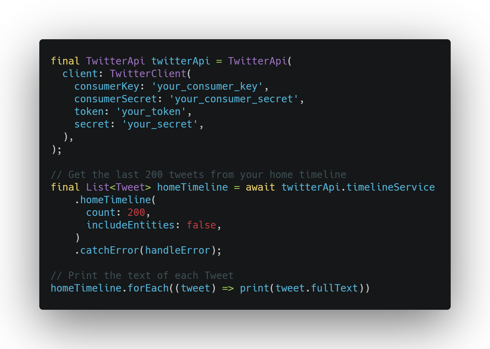

# A Dart wrapper for the Twitter API

This dart package provides a well documented wrapper for the [Twitter
API](https://developer.twitter.com/).

## Why use this package?

To make the usage as convenient and comfortable as possible, this package provides
interfaces for the various endpoints of the Twitter API. Documentation for each
request is available as dart docs and each request's parameters can be changed as
named parameters.

The various data structures returned by Twitter are parsed into data models in
an isolate.

## Example usage

## Twitter API key

Get your Twitter API key
[here](https://developer.twitter.com/en/apply-for-access).

## Features

### Implemented endpoints

The implemented API endpoints are available as methods in the corresponding
service. The request parameters can be set through named parameters and the
response will be parsed into a data object for maximum convenience.

Find a list of implemented endpoints [here](https://github.com/robertodoering/twitter_api/wiki/Implemented-API-endpoints).

---

If an API endpoint is not yet implemented, a request can be made to that
endpoint by manually using the `TwitterClient` from the `TwitterApi` object.

See [Making a custom request to the Twitter
API](https://github.com/robertodoering/twitter_api/wiki/Making-a-custom-request-to-the-Twitter-API)
for an example.

### Error handling

Requests made by the client can throw the following errors:

* `TimeoutException` when a request hasn't returned a response for some time
  (defaults to 10s, can be changed in the `TwitterClient`).

* `Response` when the received response does not have a 2xx status code. Most
  responses include additional error information that can be parsed manually from the response's body.

* Other unexpected errors in unlikely events (for example when parsing the
  response).

---

For an example of uploading media files to Twitter, see [Attaching media to a
Tweet](https://github.com/robertodoering/twitter_api/wiki/Attaching-media-to-a-Tweet).

## Development

### Contribution

I appreciate any contributions to this package. Any not yet implemented endpoints can
be added similarly to the other implementations. Feel free to reach out to me to ask any questions.

Please make sure `dartanalyzer` doesn't report any problems before opening a pull request.

### Miscellaneous

- To generate json_serializable models
  - `pub run build_runner build --delete-conflicting-outputs`
